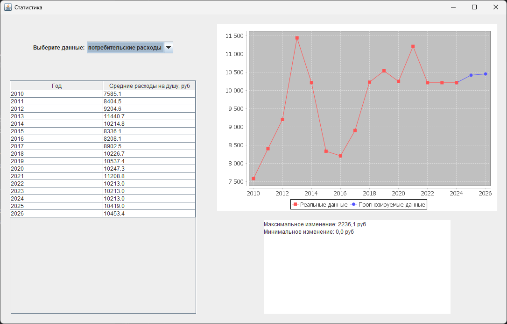

# **Технологии программирования. Лабораторная работа №3**
## **Тема: Системы контроля версий (VCS)**
Участники: Лебедев И.Ю., Сымитированный участник
## **Функционал**
### **Процент внебрачных детей**
- **Задание**: Пользователь открывает файл с данными о проценте детей, рожденных вне брака за 
последние 15 лет. Вывести эту информацию на экран в удобном табличном формате. По этим 
данным построить графики зависимости от года. Вычислить максимальный и минимальный 
процент изменения этих данных за год. Реализовать статистическое прогнозирование методом 
экстраполяции по скользящей средней на последующие N лет, вывести эту информацию на 
отдельном графике либо закрасить другим цветом на том же.

- **Формат входных данных**: `год, процент`
    > *Пример:*
    > 
    > 2009, 24.6
    > 
    > 2014, 23.0
    >
    > ...
### **Потребительские расходы**
- **Задание**: Пользователь открывает файл с данными о потребительских расходах за последние 
15 лет. Вывести эту информацию на экран в удобном табличном формате. По этим данным 
построить графики зависимости от года. Вычислить максимальный и минимальный процент 
изменения этих данных за год. Реализовать статистическое прогнозирование методом 
экстраполяции по скользящей средней на последующие N лет, вывести эту информацию на 
отдельном графике либо закрасить другим цветом на том же.

- **Формат входных данных**: `год, сумма(в рублях)`
    > *Пример:*
    > 
    > 2010, 7585.1
    > 
    > 2021, 11208.8
    >
    > ...
## **Пример работы**

